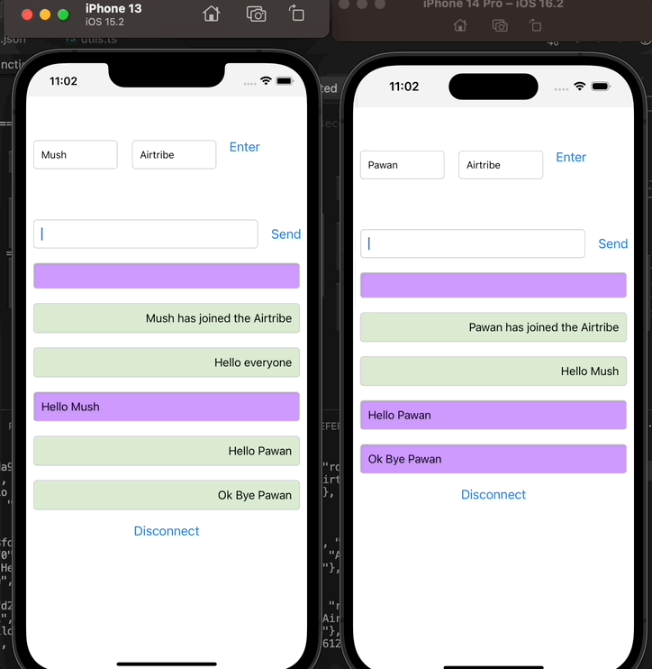

# airtribe_chatapp

A simple real-time chat application using Node.js, Express.js, and Socket.IO and React Native as mobile apps

# Start the chat server

```bash
# OR using Yarn
yarn install
yarn server
```

```bash
Listening on *:9000
```

# Getting Started for Mobile Apps

> **Note**: Make sure you have completed the [React Native - Environment Setup](https://reactnative.dev/docs/environment-setup) instructions till "Creating a new application" step, before proceeding.

## Step 1: Start the Metro Server

First, you will need to start **Metro**, the JavaScript _bundler_ that ships _with_ React Native.

To start Metro, run the following command from the _root_ of your React Native project:

```bash
cd mobile-app/chatapp
```

```bash
# using npm
npm start

# OR using Yarn
yarn start
```

## Step 2: Start your Application

Let Metro Bundler run in its _own_ terminal. Open a _new_ terminal from the _root_ of your React Native project. Run the following command to start your _Android_ or _iOS_ app:

### For Android

```bash
# using npm
npm run android

# OR using Yarn
yarn android
```

### For iOS

```bash
# using npm
npm run ios

# OR using Yarn
yarn ios
```

## Step 3: Start Chatting

- Enter a username and room name to enter a room.
- User cant enter the room without username , show a toast message to enter correct informations
- After establishing a connection Send Chat Message to the room


- Another user Enters the room and can see all chat messages and send chat messages to everone in the room
- Users can disconnect and no new messages will be broadcasted into the room.


